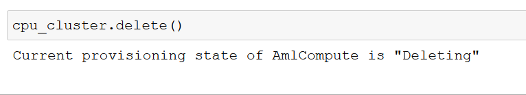

# Optimizing an ML Pipeline in Azure

## Overview
This project is part of the Udacity Azure ML Nanodegree.
In this project, we build and optimize an Azure ML pipeline using the Python SDK and a provided Scikit-learn model.
This model is then compared to an Azure AutoML run.

## Summary
 **This dataset contains data about bank marketing campaigns. In this dataset, we have performed classification in order to predict if the client will subscribe a term deposit (variable y) or not. There are 20 Input Parameters in this dataset which help in the prediction of dependent variable y.**

 **The best performing model has a accuracy of 91% in both the scenario. In this project, I have computed predictions through 2 methods:**
 **- A standard Scikit-learn Logistic Regression Model in which the hyperparameters are optimize using HyperDrive.**
 **- Performed AutoML run on the given dataset**
 
 **So, in the first case, Logistic Regression has accuracy of 91.14% with hyperparameters max-iterations (32) and regularization-strength (1.33).**
 **In second, the best run model is VotingEnsemble with accuracy of 91.64%.**

## Scikit-learn Pipeline

Pipeline Architecture of Scikit Learn Pipeline consist of

1)Train.py---> custom-coded model containing **Tabular-Dataset** and **Scikit Learn Logistic Regression**
2)Notebook(udacity-project) ----> In this, I have created **compute-cluster** for **hyperdrive model**. Hyperparameters of Logistic Regression are optimized using HypperDrive

In Scikit-learn Pipeline for bank-marketing ,first of all, clean_data function perform label_encoding of data. The clean_data function converted categorical columns into numerical form. This transformed data, then splitted into training and test set in order to perform Logistic Regression.
Logistic Regression is a binary classification algorithm(0 or 1).  It uses logistic function called the sigmoid function in order to predict outcomes. 

**Hyperparameters** are adjustable parameters that controls the model training process. Hyperparameters of logistic regression are max-iterations and regularization strength. Hyperdrive is used to tune them. **Hyperparameter tuning** is the process of finding the configuration of hyperparameters that results in the best performance. With help of hyperdrive, hyperparameters of Logistic Regression are optimized and accuracy is calculated. 

In order to determine max-iterations and regularization strength, **RandomParameterSampling** parameter sampler is used. In this sampling algorithm, parameter values are randomly chosen from a set of discrete values or a distribution over a continuous range. In the search space two parameters are defined, --C and --max-iter.The **--C**  have a uniform distribution with 0.5 as a minimum value and 1.5 as a maximum value, and the **--max-iter** will be a choice of [16, 32, 64, 128]. Random Sampling supports early termination of low-performance runs. Thus, some users do an initial search with random sampling and then refine the search space to improve results. The best run model has hyperparameters, 
--C (regularization-strength) : 1.3318946808602388 and --max-iter (Max-iterations) : 32 .

During hyperdrive configuration, **BanditPolicy** is chosen as an early termination policy. Bandit policy is based on slack factor/slack amount and evaluation interval. It terminates runs where the primary metric is not within the specified slack factor/slack amount (poorly performing runs) compared to the best performing run. Thus, improves computational efficiency. In this project, the early termination policy is applied at every even interval when metrics are reported. Any run whose best metric is less than (1/(1+0.1) or 91% of the best performing run will be terminated.

The **best run model** for Hyperdrive (Best Run Id:  HD_f570f89e-080e-4e7a-baa6-ab7a255ef9c7_16) has accuracy of **91.14%**.

## AutoML

**Automated machine learning**, also referred to as automated ML or AutoML, is the process of automating the time consuming, iterative tasks of machine learning model development. It allows data scientists, analysts, and developers to build ML models with high scale, efficiency, and productivity all while sustaining model quality.

Automated machine learning supports ensemble models. **Ensemble learning** improves machine learning results and predictive performance by combining multiple models as opposed to using single models. AutoML uses both **voting ensemble** and **stacking ensemble** methods for combining models.

In this project, AutoML rapidly iterates over many combinations of algorithms and hyperparameters, and find out the best model based on a **Accuracy** success metric.**Best run model** for the bank-marketing dataset is **VotingEnsemble**. **Voting Ensemble** technique predicts based on the weighted average of predicted class probabilities for classification tasks. Parameters generated by AutoML run are fit_intercept(True), l1_ratio(0.3877551020408163), learning_rate('invscaling'), loss=('log'), max_iter(1000), n_jobs(1), penalty('none'), power_t(0),random_state(None), tol(0.01)

 **Best run model** is **VotingEnsemble**(Best Run Id: AutoML_4b6be5f1-d3a5-4c97-a1e4-7c3087090448_56) with a accuracy of **91.64%**.

## Pipeline comparison

The best run model of SKLearn Logistic Regression Pipeline has 91.14% accuracy whereas Azure AutoML Voting Ensemble has 91.64% accuracy.
It can be clearly noticed, that Voting Ensemble model has more accuracy as compared to SKLearn Logistic Regression model. 
The main difference between two architecture is that, AutoMl has taken various combinations of algorithms and hyperparameters in account automaticaaly. Whereas in case of SKLearn pipeline, the algorithm is fixed (Logistic Regression) and various combinations of hyperparamters is taken, with the help of Hyperdrive.

## Future work

The **duration** attribute highly affects the output target (e.g., if duration=0 then y='no'). Duration here stands for last_contact_duration/ last_call_duration with customer. Thus, duration attribute should only be included for benchmark purposes and should be discarded for realistic predictive model.

For scikit-learn pipeline, taking different range of values for hyperparameters (--C and --max-iter) or  using different Logistic Regression **solver** (such as  [‘newton-cg’, ‘lbfgs’, ‘liblinear’, ‘sag’, ‘saga’]) will help in improving performance of model and choosing more robust model. 

**Cross validation** should be performed in both Scikit-Learn Pipeline and AutoML model in order to avoid **overfitting of data**.

Azure AutoML machine learning provides charts and metrics, to identify overfitted and imbalanced data, and implements best practices to help mitigate them. **Imbalanced data** can lead to a falsely perceived positive effect of a model's accuracy because the input data has **bias towards one class**. Therefore, inorder to decrease this model bias and to improve model accuracy, **Class balancing of Data** is required.

## Proof of cluster clean up

**Image of cluster marked for deletion**

